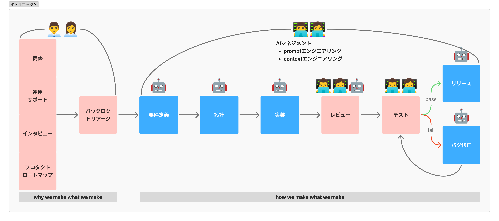
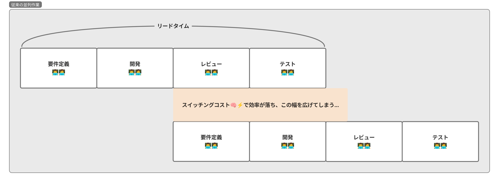
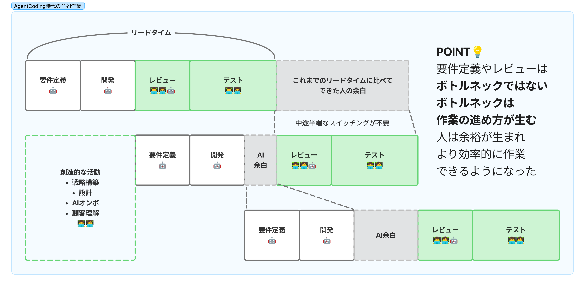

# Claude Code + Container Use<br/>と Cursor で作る<br/>ローカル並列開発環境のススメ
まえかわ @ Scalebase株式会社（旧: アルプ株式会社）のPM
- サブスクビジネス向けの販売管理SaaS作ってます
- X: [@_kaelaela](https://x.com/_kaelaela)
- profile: [kaelae.la](https://kaelae.la/)

---

## 製品開発のボトルネックはいつも"人間"

- Agentic Coding により高速な実装、レビュー、自動テストまでできる
- AI依存による創造性の低下、予期しないバグやセキュリティリスクも増加。「人力でカバー」?



---

## 今まで「人の力」で並列に進めてたものがAIに置き換わる

- 事業/組織/製品/チーム/開発など、会社でやってることはほぼAIで並列前提になっていく
- 並列数をあげてどんな効果を期待するのか？はものによる
- 開発でも「どのくらい並列すれば最もROIがいいのか？」をチューニングしていく



---

##  並列Agentic Codingのボトルネックへの誤解

- 人の作業はもともと直列なので**阻害しない**がキホン。並列させるのは集中力や学習コストがないAI



---

## 並列Agentic Codingのカオス

とはいえ並列開発には他にも問題がある。カオスの2パターン

**ローカルでYOLOしく**: ファイル競合や作業環境破壊が発生し、何が起きてるか不明瞭 🤖💥💻💥🤖
- 例: 単純なClaude Codeによる並列化 / 複数人のDev Container利用 など
- 特にE2Eテストまで実行しようとすると途端に動かなくなる

**リモートAIに祈る**: 環境の障害点が増える、環境準備がどれも独自、秘密情報の扱いがいむずい  🕌🙏
- 例: Claude Code Actions / Copilot Agent / Cursor Background Agent / Vertex AI / Devin など

[参考: Dagger Blog - Containing agent chaos](https://dagger.io/blog/agent-container-use)

---

## 提案:<br/>**Claude Code + Container Use**<br/>+ **Cursor**を使い、ローカルで安全な並列開発をしよう

 **Claude Code + Container Use**: 各AIに独立した環境を提供、相互破壊を防ぐ。また切り替えも簡単
 
**\+ Cursor**: 作業デスクとして活用。モデルを変えた実装や修正などに使う

---

## **Container Use**とは？

- Dagger社製の「Gitブランチ = コンテナ環境」 をシンプルに実現できるCLIツール
- ブランチごとに並列開発でき、Dockerベースで軽量・速い
- Dev Containerじゃだめなの？ > それは人向け。これはAI向け。ChatからAgentが自律的に環境作成をしてくれるのがGood

導入

- daggerのインストール
  - `curl -fsSL https://raw.githubusercontent.com/dagger/container-use/main/install.sh | bash`
- ClaudeCode / CursorにMCPサーバーを追加
  - Claude: `claude mcp add container-use -- cu stdio`
  - Cursor: `https://cursor.com/install-mcp?name=container-use&config=eyJjb21tYW5kIjoiY3Ugc3RkaW8ifQ%3D%3D`
- Coding Rulesに追記
  - Claude: `curl https://raw.githubusercontent.com/dagger/container-use/main/rules/agent.md >> CLAUDE.md`
  - Cursor: `curl --create-dirs -o .cursor/rules/container-use.mdc https://raw.githubusercontent.com/dagger/container-use/main/rules/cursor.mdc`

---

## Container Useを使った並列開発

あとはChatからいつものように「〜を修正して」というだけ。ContainerUseの操作は以下

```bash
# 並列環境一覧を表示する
$ cu list 
ID               TITLE         CREATED       UPDATED
trusty-aardvark  XXXX          23 hours ago  23 hours ago
...
# 環境のターミナルを開く
$ cu terminal ID
# git tree形式で各コンテナの作業をみる
$ cu watch 
# git branchが作成され、作業がローカルに展開される
$ cu checkout ID
# 不要になった環境の削除
$ cu delete ID 
Deleting worktree ...
# 作業ブランチへのマージ
$ cu merge trusty-aardvark 
```

---

## まとめ

ボトルネックの誤解: 人がやる作業を並列にしない。Agentic Codingはいくら並列してもいい
ローカルで並列Agentic Codingの問題: ファイル競合、DB不整合など環境汚染がある

#### **Claude Code + Container Use / Cursorを使って安全に並列開発しよう**

ありがとうございました！
会社、製品、まえかわに興味ある方お声がけください🙋

